# LobsterBoard Mobile Dashboard

LobsterBoard includes a fully responsive mobile-first dashboard that lets you monitor your server from any phone or tablet. Connect to your self-hosted LobsterBoard instance and get real-time widget data on the go.

## Getting Connected

When you open LobsterBoard Mobile, you're greeted with a simple connection screen. Enter your server's URL (e.g. `http://192.168.1.100:3000`) and tap **Connect**.

<p align="center">
  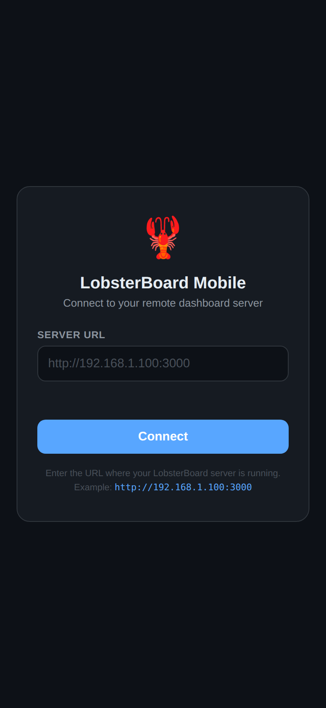
</p>

---

## Stream View

The default view mode is **Stream** — a vertically scrolling feed of all your widgets, optimized for one-handed browsing. Widgets stack in a single column with smart 2-up grids for smaller cards like Claude Usage, AI Cost Tracker, Active Sessions, and Token Gauge.

A bottom navigation bar lets you filter by category: **All**, **OpenClaw**, **AI**, and **System**.

<p align="center">
  
  &nbsp;&nbsp;
  
</p>

### Full Page Stream

The stream continues with system monitoring widgets (CPU & Memory, Disk Usage, Network Speed, etc.) as you scroll further down.

<p align="center">
  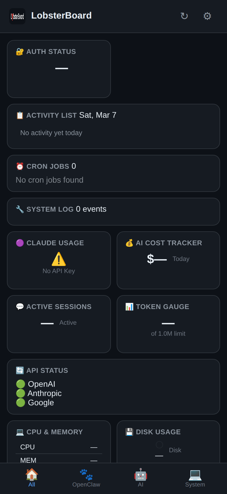
</p>

---

## Category Filters

The bottom navigation bar filters widgets by category. Tap a category to show only relevant widgets:

### OpenClaw Widgets
Auth Status, Activity List, Cron Jobs, and System Log — everything you need to monitor your OpenClaw instance.

<p align="center">
  
</p>

### AI Widgets
Claude Usage, AI Cost Tracker, Active Sessions, Token Gauge, and API Status — keep tabs on your LLM spending and availability.

<p align="center">
  
</p>

### System Widgets
CPU & Memory, Disk Usage, Network Speed, and Uptime — your server health at a glance.

<p align="center">
  
</p>

---

## Settings Drawer

Tap the gear icon in the top-right to open the settings drawer. From here you can:

- Switch between **Stream**, **Tabs**, and **Command** view modes
- Change the theme
- Jump to the desktop builder

<p align="center">
  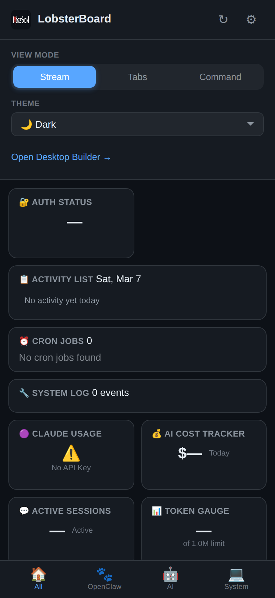
</p>

---

## Tabs View

**Tabs** view organizes widgets into category tabs — **OpenClaw**, **AI / LLM**, and **System** — with badge counts showing how many widgets are in each group.

<p align="center">
  
  &nbsp;&nbsp;
  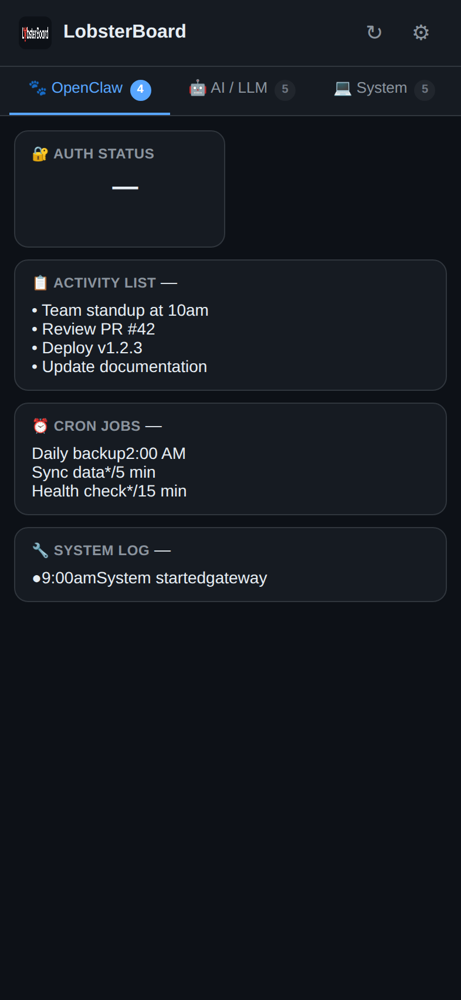
</p>

### Tabs Full Page

Scroll within each tab to see all widgets in that category.

<p align="center">
  
</p>

---

## Command Center View

**Command** view is a dense, information-rich layout with a live system stats bar at the top (CPU, Memory, Uptime, Network) and collapsible category sections below.

<p align="center">
  
  &nbsp;&nbsp;
  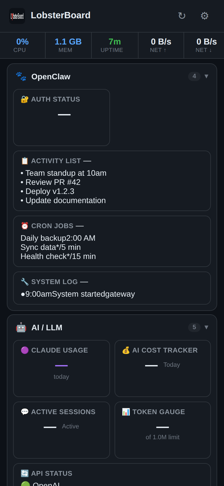
</p>

---

## Fullscreen Widget

Tap any widget to expand it to fullscreen for a closer look. A title bar shows the widget name and an **X** button to close.

<p align="center">
  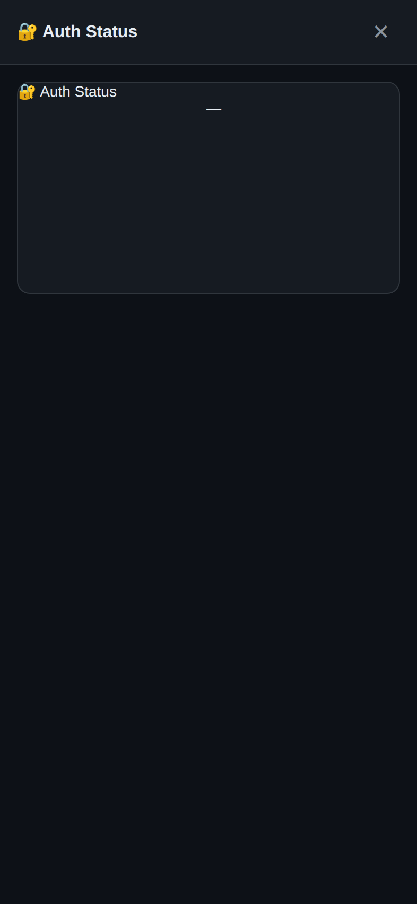
</p>

---

## Themes

All 5 LobsterBoard themes are fully supported on mobile. Switch themes from the settings drawer.

### Feminine
Soft pink and lavender pastels with a light, airy feel.

<p align="center">
  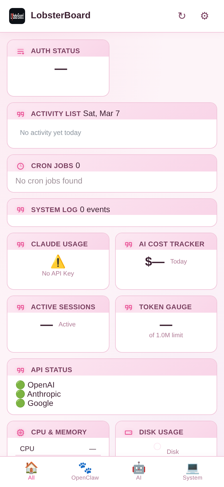
</p>

### Feminine Dark
Pink and purple accents on a dark background.

<p align="center">
  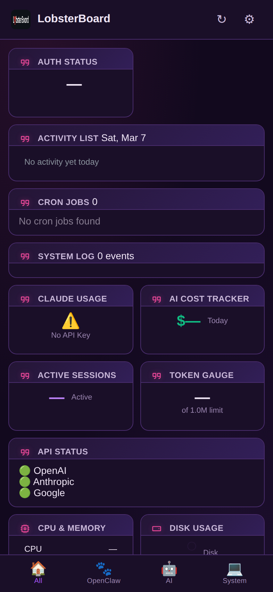
</p>

### Terminal
Green CRT aesthetic with monospace fonts and scanline effects.

<p align="center">
  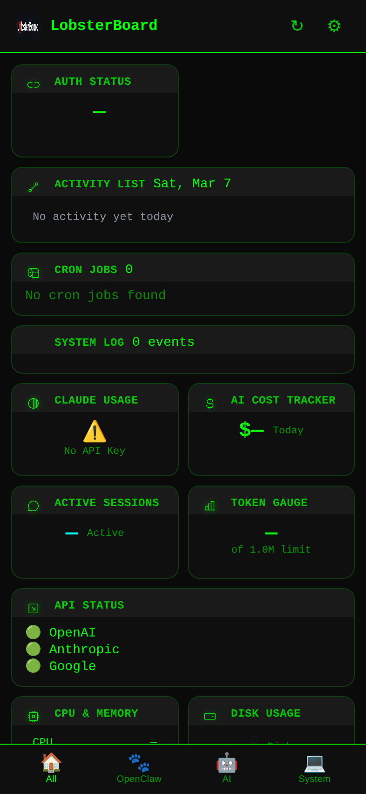
</p>

### Paper
Warm cream and sepia tones with serif typography.

<p align="center">
  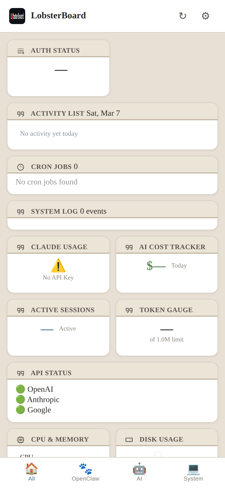
</p>

### Terminal + Command Center

The Terminal theme pairs particularly well with Command Center view for a full retro monitoring station feel.

<p align="center">
  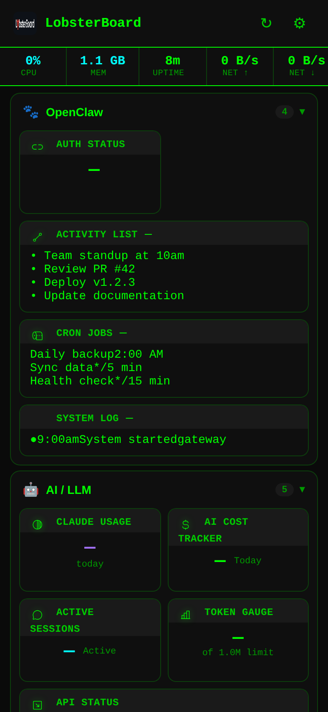
</p>

---

## Settings + View Switcher

The settings drawer lets you toggle between all three view modes and switch themes without leaving the mobile dashboard.

<p align="center">
  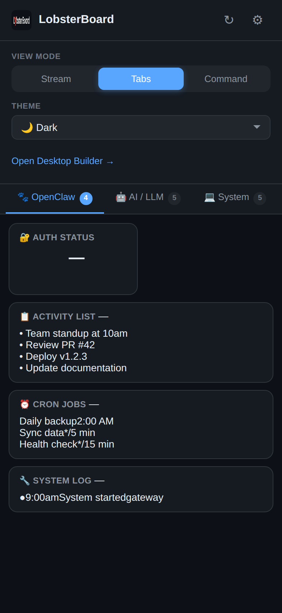
</p>

---

## How to Use

1. Start your LobsterBoard server with network access:
   ```bash
   HOST=0.0.0.0 node server.cjs
   ```

2. Open your phone's browser and navigate to your server's IP address (e.g. `http://192.168.1.100:8080`)

3. The mobile dashboard loads automatically — enter your server URL on the connection screen and tap **Connect**

4. Use the bottom nav to filter widgets, the gear icon for settings, and tap any widget to go fullscreen
